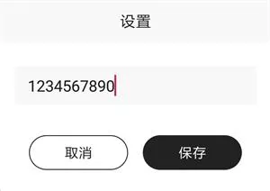

## TangramDialog
Android 对话框，基于DialogFragment，可自定义布局及动画，可指定弹出位置(顶部、居中、底部)  

  

  

### 添加依赖
#### Step 1. Add the JitPack repository to your build file
Add it in your root build.gradle at the end of repositories:  

	allprojects {
		repositories {
			...
			maven { url 'https://jitpack.io' }
		}
	}  

#### Step 2. Add the dependency

	dependencies {
        implementation 'com.github.EthanCo:TangramDialog:1.0.5'
	}

### 使用
#### 基本使用

	TangramDialog dialog = new TangramDialog.Builder(MainActivity.this)
		.title("标题")
		.content("这是具体内容")
		.positiveText("确定")
		.negativeText("取消")
		.canceledOnTouchOutside(true)
		.onPositive(new ButtonCallback() {
		    @Override
		    public void onClick(DialogBase dialog, View view) {
		        //确定
		    }
		})
		.onNegative(new ButtonCallback() {
		    @Override
		    public void onClick(DialogBase dialog, View view) {
		        //取消
		    }
		})
		.show();

#### 具体方法

	/**
         * 设置标题
         *
         * @param title
         * @return
         */
        public Builder title(CharSequence title)

        /**
         * 设置标题
         *
         * @param titleRes
         * @return
         */
        public Builder title(@StringRes int titleRes)

        /**
         * 标题颜色
         *
         * @param colorRes
         * @return
         */
        public Builder titleColorRes(@ColorRes int colorRes)

        /**
         * 标题字体大小
         *
         * @param textSize
         * @return
         */
        public Builder titleTextSize(float textSize)

        /**
         * 内容文字
         *
         * @param content
         * @return
         */
        public Builder content(CharSequence content)

        /**
         * 内容文字
         *
         * @param contentRes
         * @return
         */
        public Builder content(@StringRes int contentRes)

        /**
         * 内容文字颜色
         *
         * @param colorRes
         * @return
         */
        public Builder contentColorRes(@ColorRes int colorRes)

        /**
         * 内容文字字体
         *
         * @param textSize
         * @return
         */
        public Builder contentTextSize(float textSize)

        /**
         * 图片资源ID
         *
         * @param imgRes
         * @return
         */
        public Builder imgRes(@DrawableRes int imgRes)

        /**
         * 对话框布局，用作替换默认布局样式，id需要和默认布局保持一致
         *
         * @param layoutId
         * @return
         */
        public Builder layoutId(int layoutId)

        /**
         * 否定的按钮文字
         *
         * @param message
         * @return
         */
        public Builder negativeText(CharSequence message)

        /**
         * 否定的按钮文字
         *
         * @param messageRes
         * @return
         */
        public Builder negativeText(@StringRes int messageRes)

        /**
         * 中立的按钮文字
         *
         * @param message
         * @return
         */
        public Builder neutralText(CharSequence message)

        /**
         * 中立的按钮文字
         *
         * @param messageRes
         * @return
         */
        public Builder neutralText(@StringRes int messageRes)

        /**
         * 肯定的按钮文字
         *
         * @param message
         * @return
         */
        public Builder positiveText(CharSequence message)

        /**
         * 肯定的按钮文字
         *
         * @param messageRes
         * @return
         */
        public Builder positiveText(@StringRes int messageRes)

        /**
         * 对话框位置
         *
         * @param gravity {@link android.view.Gravity#TOP}:顶部
         *                {@link android.view.Gravity#CENTER}:居中
         *                {@link android.view.Gravity#BOTTOM}:底部
         * @return
         */
        public Builder gravity(int gravity)

        /**
         * 对话框 显示/隐藏 动画
         *
         * @param animStyle
         * @return
         */
        public Builder animStyle(int animStyle)

        /**
         * 指定对话框宽度
         *
         * @param width
         * @return
         */
        public Builder width(int width)

        /**
         * 指定对话框高度
         *
         * @param height
         * @return
         */
        public Builder height(int height)

        /**
         * 肯定的按钮 点击回调
         *
         * @param callback
         * @return
         */
        public Builder onPositive(@NonNull ButtonCallback callback)

        /**
         * 中立的按钮 点击回调
         *
         * @param callback
         * @return
         */
        public Builder onNeutral(@NonNull ButtonCallback callback)

        /**
         * 否定的按钮 点击回调
         *
         * @param callback
         * @return
         */
        public Builder onNegative(@NonNull ButtonCallback callback)

        /**
         * 对话框外围 点击是否可隐藏
         *
         * @param canceledOnTouchOutside
         * @return
         */
        public Builder canceledOnTouchOutside(boolean canceledOnTouchOutside)

        /**
         * 对话框 margin
         *
         * @param margin
         * @return
         */
        public Builder margin(int margin)

        /**
         * 背景的昏暗度
         *
         * @param dimAmount
         * @return
         */
        public Builder dimAmount(@FloatRange(from = 0, to = 1) float dimAmount)

        /**
         * 设置背景
         * 例如 new ColorDrawable(Color.BLUE) //蓝色
         * new ColorDrawable(Color.TRANSPARENT) //透明
         *
         * @param drawable
         * @return
         */
        public Builder background(Drawable drawable)

        /**
         * 设置背景色
         *
         * @param backgroundColor
         * @return
         */
        public Builder backgroundColor(@ColorRes int backgroundColor)

        /**
         * 设置自定义的View，此模式下需手动findViewById来设置UI及相关点击回调
         * 通过{@link DialogBase#getRootView()}获取根View
         *
         * @param customView
         * @return
         */
        public Builder customView(View customView)

        /**
         * 设置自定义的View，此模式下需手动findViewById来设置UI及相关点击回调
         * 通过{@link DialogBase#getRootView()}获取根View
         *
         * @param layoutRes
         * @return
         */
        public Builder customView(@LayoutRes int layoutRes)

        /**
         * 点击按钮是否自动隐藏对话框
         *
         * @param dismiss
         * @return
         */
        public Builder autoDismiss(boolean dismiss)

        /**
         * 对话框相对自身位置X轴的偏移量
         *
         * @param offsetX
         * @return
         */
        public Builder offsetX(int offsetX)

        /**
         * 对话框相对自身位置Y轴的偏移量
         *
         * @param offsetY
         * @return
         */
        public Builder offsetY(int offsetY)

        /**
         * 点击背景 点击事件是否穿透
         *
         * @param canPenetrate
         * @return
         */
        public Builder canPenetrate(boolean canPenetrate)

        /**
         * 显示输入框
         *
         * @param hint     hint文字
         * @param prefill  预加载的文字
         * @param callback 输入改变回调
         * @return
         */
        public Builder input(
                @Nullable CharSequence hint,
                @Nullable CharSequence prefill,
                @NonNull InputCallback callback)

        /**
         * 显示输入框
         *
         * @param hint            hint文字
         * @param prefill         预加载的文字
         * @param allowEmptyInput 是否允许为空
         * @param callback        输入改变回调
         * @return
         */
        public Builder input(
                @Nullable CharSequence hint,
                @Nullable CharSequence prefill,
                boolean allowEmptyInput,
                @NonNull InputCallback callback)

        /**
         * 显示输入框
         *
         * @param hint            hint文字
         * @param prefill         预加载的文字
         * @param allowEmptyInput 是否允许为空
         * @param callback        输入改变回调
         * @return
         */
        public Builder input(
                @StringRes int hint,
                @StringRes int prefill,
                boolean allowEmptyInput,
                @NonNull InputCallback callback)

        /**
         * 显示输入框
         *
         * @param hint     hint文字
         * @param prefill  预加载的文字
         * @param callback 输入改变回调
         * @return
         */
        public Builder input(
                @StringRes int hint, 
				@StringRes int prefill,
				@NonNull InputCallback callback)

#### 自定义样式对话框  
针对对话框样式需要自定义，但是对话框功能基本相同(标题、确定按钮、取消按钮等)，可更改默认布局为自定义布局，与默认布局id保持一致。  

> 对话框的默认布局为 [dialog_tangram.xml](https://github.com/EthanCo/TangramDialog/blob/master/tangramdialog/src/main/res/layout/dialog_tangram.xml)

比如，我们要实现一个如下自定义样式的对话框  

  

我们需要新建一个布局文件，比如dialog_custom_styles  

	<?xml version="1.0" encoding="utf-8"?>
	<LinearLayout xmlns:android="http://schemas.android.com/apk/res/android"
	    xmlns:app="http://schemas.android.com/apk/res-auto"
	    android:layout_width="match_parent"
	    android:layout_height="wrap_content"
	    android:background="@drawable/shape_white_solid_4"
	    android:orientation="vertical">
	
	    <TextView
	        android:id="@+id/tv_title_tangram"
	        android:layout_width="match_parent"
	        android:layout_height="50dp"
	        android:background="@drawable/shape_gray_solid_4"
	        android:gravity="center"
	        android:text="标题"
	        android:textSize="16sp"
	        android:textColor="#222222" />
	
	    <EditText
	        android:id="@+id/et_input_tangram"
	        android:layout_width="match_parent"
	        android:layout_height="45dp"
	        android:layout_marginLeft="17dp"
	        android:layout_marginTop="27dp"
	        android:layout_marginRight="17dp"
	        android:background="@drawable/shape_gray_solid_2"
	        android:gravity="center_vertical"
	        android:maxLength="20"
	        android:paddingLeft="15dp"
	        android:paddingRight="15dp" />
	
	    <LinearLayout
	        android:id="@+id/layout_buttons_tangram"
	        android:layout_width="match_parent"
	        android:layout_height="40dp"
	        android:layout_marginLeft="25dp"
	        android:layout_marginTop="35dp"
	        android:layout_marginRight="25dp"
	        android:layout_marginBottom="25dp"
	        android:gravity="center"
	        android:orientation="horizontal">
	
	        <FrameLayout
	            android:id="@+id/layout_negative_tangram"
	            android:layout_width="0dp"
	            android:layout_height="match_parent"
	            android:layout_weight="1">
	
	            <TextView
	                android:textSize="16sp"
	                android:id="@+id/tv_negative_tangram"
	                android:layout_width="114dp"
	                android:layout_height="match_parent"
	                android:layout_gravity="center"
	                android:layout_marginLeft="12dp"
	                android:layout_marginRight="12dp"
	                android:background="@drawable/shape_black_stroke_30"
	                android:gravity="center"
	                android:text="取消"
	                android:textColor="#222222" />
	        </FrameLayout>
	
	
	        <FrameLayout
	            android:id="@+id/layout_positive_tangram"
	            android:layout_width="0dp"
	            android:layout_height="match_parent"
	            android:layout_weight="1">
	
	            <TextView
	                android:id="@+id/tv_positive_tangram"
	                android:layout_width="114dp"
	                android:layout_height="match_parent"
	                android:layout_gravity="center"
	                android:layout_marginLeft="12dp"
	                android:layout_marginRight="12dp"
	                android:background="@drawable/shape_bike_checked"
	                android:gravity="center"
	                android:text="保存"
	                android:textColor="#FFFFFF"
	                android:textSize="16sp" />
	        </FrameLayout>
	    </LinearLayout>
	</LinearLayout>

接着，我们把layoutId指定为dialog_custom_styles，即可照常使用TangramDialog  

	TangramDialog dialog = new TangramDialog.Builder(MainActivity.this)
        .layoutId(R.layout.dialog_custom_styles)
        .title("设置")
        .titleTextSize(18)
        .input("hint", "1234567890", null)
        .negativeText("取消")
        .positiveText("保存")
        .onPositive(new ButtonCallback() {
            @Override
            public void onClick(@NonNull DialogBase dialog, @NonNull View v) {
                Toast.makeText(MainActivity.this, "保存完毕", Toast.LENGTH_SHORT).show();
            }
        })
        .show();  

#### 自定义布局
对于需要自定义样式，且对话框功能不是基础功能(标题、确定按钮、取消按钮等)，可使用自定义布局，此模式下需手动findViewById来设置UI及相关点击回调  

	TangramDialog dialog = new TangramDialog.Builder(MainActivity.this)
            .customView(R.layout.dialog_custom)
            .canceledOnTouchOutside(true)
            .show();
    View rootView = dialog.getRootView();
    TextView tvTitle = rootView.findViewById(R.id.tv_title);
    TextView btnClickMe = rootView.findViewById(R.id.btn_click_me);
    tvTitle.setText("Hello World!");
    btnClickMe.setOnClickListener(new View.OnClickListener() {
        @Override
        public void onClick(View v) {
            Toast.makeText(MainActivity.this, "Click Me!", Toast.LENGTH_SHORT).show();
            dialog.dismiss();
        }
    });
